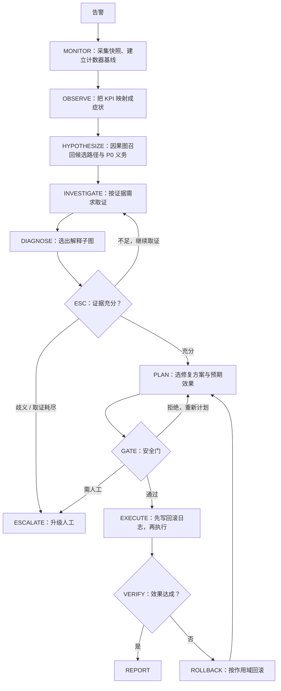

# pgdoctor

**面向 PostgreSQL 的自主诊断与修复 Agent。**

pgdoctor 从一条告警出发，按 DBA 的做法做鉴别诊断：先列出可能的根因，再逐条取证，把竞争假设一一排除。证据不够时，它停下来升级人工；修复只能经过确定性的安全门执行，修不好就自动回滚。

> 它要解决的不是"让 agent 更聪明"，而是**让它在不够聪明的时候不闯祸，在证据充分的时候把问题修好**。

一次真实运行（缺索引场景，节选）：

```text
告警         p99 > 300ms 且 cpu > 150%
OBSERVE      症状：latency_p99_up、cpu_saturated、throughput_down
HYPOTHESIZE  因果图召回 15 条候选路径，登记 3 项高危根因（P0）的排查义务
INVESTIGATE  两轮取证：执行计划、表统计、窗口内的顺序扫描量、阻塞链、连接数……
DIAGNOSE     missing_index → 三个症状；9 条竞争路径被证据反证
ESC          证据充分性检查 8 项全部通过 → SUFFICIENT
PLAN         先用 hypopg 模拟新索引，确认优化器会用，再提交方案
GATE         AST 护盾、风险分级、回滚方案检查通过 → CONFIRM
EXECUTE      先写回滚日志，再执行 CREATE INDEX CONCURRENTLY
VERIFY       p99 5014ms → 71ms，预期效果达成，回归检查通过
DONE         诊断 ✓  修复 ✓  安全 ✓
```

## 目录

- [背景](#背景)
- [亮点](#亮点)
- [原理](#原理)
- [实现方式](#实现方式)
- [快速开始](#快速开始)
- [用户手册](#用户手册)
- [评测结果](#评测结果)
- [已知局限](#已知局限)
- [开发与文档](#开发与文档)

## 背景

2026 年的 DBA-Bench 在生产保真度的故障场景上评测自动化运维 agent，结果如下：

| | 诊断正确（Diagnosis） | 安全解决（Safe Pass） |
|---|---|---|
| 最好的自动化 agent | 32.7% | **17.9%** |
| 人类 DBA | — | **93.4%** |

agent"说对根因"的比例，明显高于它"安全地把问题修好"的比例。两者之间的差距，主要来自**静默失败**：agent 查了两个视图，编出一个听上去合理、格式工整、语气自信的根因，然后基于这个错误的根因去改生产库。整个过程没有报错，也没有任何信号提示它错了。

pgdoctor 针对的就是这个差距。它把两件事从模型手里拿走：

1. **判断"证据够不够"**：由确定性的规则和检查决定，模型不能给自己打分。
2. **修改数据库的权力**：agent 只有只读连接，写操作由安全门独占。

## 亮点

- **做鉴别诊断，不顺着表象往下编。**
  - 故障因果图从症状出发多跳反查候选根因路径，每条路径逐段取证。
  - 竞争路径必须被证据反证才能排除。
  - 误导性告警也能分清。例如告警看起来是"连接打满"，真根因其实是"长事务堆积占满连接"：系统会把后者选为根因，同时用证据反证"连接打满本身就是根因"。
- **证据由规则判定，不由模型判定。**
  - 工具产出结构化观测，由确定性判据（predicate）给出"支持 / 反证 / 中立"。
  - 能否进入修复，由 8 项互不补偿的证据充分性检查（ESC）决定。
- **安全是结构保证，不是提示词约束。**
  - agent 全程只持有只读连接，没有任何能写库的工具。
  - 写权限由安全门独占，经过基于 SQL AST 的护盾、四维风险分级和"先写后做"的回滚日志三道关。
- **知道自己的动作会污染证据。**
  - 自己跑的 `EXPLAIN ANALYZE` 产生的扫描和临时文件外溢，会从累计计数器里扣掉。
  - 跨过自己写操作的观测窗口不予采信。
  - "某个假设成立时，哪些证据会失真"在因果图上显式建模。
- **便宜。** 参数由告警确定的取证由系统直接执行，只有需要设计索引的反事实模拟才交给子 agent。5 个故障场景跑一轮约 **$0.9**，约 35–40 分钟（含环境重置与预热）。
- **可复现的评测台。**
  - Docker 沙箱里有 1200 万行订单数据，配合故障注入和 golden 快照回滚。
  - 执行轨迹完整落盘，可以离线重放。
  - 59 个离线验收脚本守住每一条规则。

最新一轮评测（5 个故障场景，eval split）：诊断、严格诊断、修复、安全解决**均为 5/5**。详见[评测结果](#评测结果)。

## 原理

### 1. 诊断就是选出一个"解释子图"

pgdoctor 不直接问模型"根因是什么"。它先从故障因果图里，把能解释当前症状的所有候选路径都找出来：

```text
观测到的症状
  → 候选因果路径（因果图多跳反查，例如 long_idle_transaction → connection_exhaustion → throughput_down）
  → 待验证的前沿（frontier）：还没有证据的节点和边
  → 证据需求（EvidenceNeed）：要什么证据、证明哪条路径的哪一段、用什么判据
  → 取证 → 判据 → 证据绑定
  → 选中的解释子图 → 修复目标与预期效果
```

几点说明：

- **因果图规模**：60 个节点（7 个症状、14 类根因、25 类证据、14 种修复），106 条边。它按 PostgreSQL 官方手册扩充，每条关系都标注了出处。
- **角色取决于路径**：同一个节点在一条路径上可能是根因，在另一条路径上可能是中间机制。例如"连接打满"在长事务路径里是中间机制。
- **高危根因单独登记**：复制槽滞留、孤立的预备事务、磁盘压力、autovacuum 停摆这类根因，会被登记成 **P0 义务**。每一项都必须被确认或逐项反证，不能因为排序靠后就被忽略。

### 2. 证据：观测 → 判据 → 绑定

- **工具就地萃取**：工具在内部把原始输出解析成结构化摘要，原文落盘并留下 `raw_ref`，可随时追溯。模型不需要"读一遍才知道重点"。
- **判据给方向**：确定性判据把观测判成 `SUPPORTS` / `REFUTES` / `NEUTRAL` / `NOT_APPLICABLE`。工具失败、权限不足、结果未知**都不等于反证**。
- **反证有作用域**：

| 作用域 | 反证的对象 |
|---|---|
| `NODE` | 这个根因节点，以及经过它的所有路径 |
| `PATH` | 某一条因果边 |
| `ROOT` | 只针对"以它为根"的路径，不影响它在别的路径上作为中间机制 |
| `INTERVENTION` | 只否定某个具体的修复方案 |

- **只能低估的结果不许用来否定**：测量不完整时，给出的只是下界。下界越过阈值可以支持结论，但下界没越过阈值不能用来反证。

### 3. 证据充分性检查（ESC）

诊断能否进入修复阶段，由 8 项检查共同决定，任何一项不过都不行，也不能靠其他项的高分补偿：

| 检查 | 判什么 |
|---|---|
| 症状覆盖 | 每个观测到的症状都被选中的路径解释，或被明确列为"未解释" |
| 根因必需证据 | 选中路径的根因具备它必需的证据 |
| 因果连续性 | 路径上的每个节点和每条因果边都有作用域正确的支持证据 |
| 替代路径 | 主要的竞争路径已被可信的反证关闭 |
| P0 义务 | 每条可达的高危路径都已确认或被逐项反证 |
| 证据可信 | 证据新鲜、来源对得上、可追溯到本次执行轨迹 |
| 图版本 | 解释所用的因果图仍是当前版本 |
| 部分解释 | "部分解释"没有把独立故障或未决 P0 留在范围外 |

检查结果有四种：
- **SUFFICIENT**：进入修复。
- **INSUFFICIENT**：给出具体的证据需求，继续取证。
- **AMBIGUOUS**：多条竞争路径都有支持、无法区分，升级人工。
- **EXHAUSTED**：预算用尽或证据长期取不到，升级人工。

### 4. 证据污染与"接地"

有些证据本身不中立。例如执行计划是规划器的输出，而规划器依赖统计信息；统计过期时，用执行计划去判断"是否缺索引"就是循环论证。

pgdoctor 为每类证据标注它的数值来源（provenance），再由规则推出"哪个假设成立时会让这条证据失真"，形成**污染边**，比如 `stale_statistics ⇝ missing_index`。有两条规则：
- 被尚未排除的污染源污染的反证，不给方向。
- 每个根因都必须至少有一条**干净的**可反证证据；图结构检查会把缺口报成失败。

### 5. 窗口类证据

死锁数、临时文件外溢、检查点、顺序扫描量等都是**累计计数器**，单次读数说明不了问题，必须看一段时间窗口内的增量。处理方式如下：

- **告警时就建基线**：告警触发后（MONITOR 阶段）立即为库级计数器和目标表建立基线。
- **窗口太短不许否定**：窗口短于 30 秒时，零增量只是下界，只能支持，不能反证。
- **按需等待**：只有当前任务确实需要窗口证据时，才会等到窗口满 30 秒再读。窗口不够长的读数不推进基线，下一次读数可以沿用更长的窗口。
- **扣除自己的扫描**：agent 自己执行的查询（`EXPLAIN ANALYZE`、统计值域扫描）产生的扫描和外溢，会按记账从计数器里扣除。
- **不采信跨自家写操作的窗口**：观测窗口如果跨过了本次执行的修复动作，这段证据不可信。

### 6. 修复、验证与回滚

- **PLAN**：只能针对选中路径上的干预目标，选择图上登记的修复方式，并写明预期影响哪些下游指标、方向和观察窗口。索引类方案必须先用 hypopg 模拟，证明优化器确实会用。
- **GATE**：先核对方案是否属于当前的因果上下文，再用 `pglast` 解析 SQL 的 AST，检查实际动作。例如夹带在建索引语句后面的 `DROP TABLE` 会被识别出来。然后按动作类别、可逆性、影响面、数据安全四个维度分级：`AUTO`（自动执行）、`CONFIRM`（需要确认）或 `DENY`（拒绝）。
- **EXECUTE**：先把回滚方案落盘（WAL 式，fsync），再执行。即使进程崩溃，重启后也能知道哪些变更待撤销。
- **VERIFY**：同时检查故障指标是否恢复、回归查询是否正常、方案声称的下游效果是否达成。失败时按作用域回滚：先否定具体方案，再否定路径片段，不会一次失败就把根因判死。

## 实现方式

### 架构：外层确定性状态机 + 内层 Claude



从 MONITOR 到 PLAN 全程只读（`agent_ro`），只有 EXECUTE 和 ROLLBACK 由安全门持有写连接（`agent_rw`）。

职责划分是：**模型决定查什么、怎么修，状态机决定能不能往前走。**

- **主策略**（Claude Agent SDK）：负责提出假设、设计修复方案。工具以进程内 MCP server 挂载，PreToolUse hook 按阶段和当前任务裁剪可用工具。
- **取证编排**：由系统完成，不由模型规划。参数完全由告警确定的工具（执行计划、表统计、连接数、阻塞链等）由编排器直接执行；只有需要设计索引定义的反事实模拟交给子 agent，最多 4 个并发。同一轮里先读累计计数器，再跑会执行查询的工具。
- **上下文可以丢弃**：`EpisodeState` 和回滚日志才是持久的真相源。每个阶段的提示都从状态重建，不累积对话，所以上下文不随 episode 变长。
- **非参数自进化（L1–L4）**：案例记忆、调查策略、因果权重、工具信息增益。只改外部知识，不训练模型，也不能放宽任何安全约束。

### 代码结构

| 目录 | 内容 |
|---|---|
| `agent/` | 状态机主循环 `loop.py`；策略 `llm_policy.py`（Claude）与 `policy.py`（确定性基线）；工具箱与权限 `toolbox.py`、`permissions.py`；取证规划与编排 `tool_planner.py`、`orchestrator.py`、`investigator.py`；证据充分性检查 `esc.py`；解释子图运行时 `explanation_runtime.py` |
| `knowledge/` | 故障因果图 `causal_graph/`（`nodes.yaml`、`edges.yaml`、`graph.py`）；证据判据 `evidence_predicates.py`；案例库与自进化 `case_store.py`、`evolution.py`、`learned/` |
| `safety/` | AST 护盾 `shield.py`、分级安全门 `gate.py`、回滚日志 `undo_journal.py` |
| `sandbox/` | 连接与角色 `db.py`；只读观测工具 `observe.py`；评测环境 `env.py`；故障注入 `injectors/`；场景定义 `scenarios/`；负载生成 `workload.py`；快照 `snapshot.py`；KPI 与判分 `metrics.py`、`scoring.py` |
| `eval/` | 批量评测 `run_suite.py`、指标 `metrics_v2.py`、轨迹重放 `replay.py`、结果与缺陷报告 `results/` |
| `docker/` | PostgreSQL 16 沙箱镜像与初始化脚本 |
| `.dev/` | 离线验收（`checkall.sh` 及 59 个检查）、跑批守护（`eval_guard.py`、`run_guard.sh`）、活库标定脚本 |
| `traces/` | 每个 episode 的执行轨迹（运行时生成） |

技术栈：Python 3.10+ · Claude Agent SDK · PostgreSQL 16（pg_stat_statements、hypopg、pgstattuple）· pglast · networkx · Docker

## 快速开始

### 环境要求

- Linux，或 Windows 11 + WSL2（Ubuntu）
- Docker 与 Docker Compose
- Python 3.10 及以上
- 8 GB 以上内存；约 6 GB 可用磁盘（数据库约 1.7 GB，另有 golden 快照）
- 只有运行 Claude 策略时才需要：已登录的 Claude Code CLI（claude.ai 订阅），或 `ANTHROPIC_API_KEY`

### 1. 安装依赖

```bash
git clone https://github.com/daoan114514/pgdoctor.git
cd pgdoctor
python3 -m pip install -r requirements.txt
```

### 2. 启动沙箱数据库

```bash
cd docker && docker compose up -d && cd ..
python3 -m sandbox.snapshot create
```

- **首次启动会慢一些**：要灌入 1200 万行订单，约需数分钟。
- **golden 快照**：灌完数据后，`snapshot create` 把健康状态固化成 golden 模板。之后每个 episode 开始前都会从它恢复，约 30 秒。
- **想先小规模试用**：首次启动前，把 `docker/docker-compose.yml` 里的 `SEED_ORDERS` 调小，例如 `500000`。

### 3. 看演示（不需要 API）

```bash
python3 demo.py 3        # 证据不足被拦：纯离线，不需要数据库，约 1 秒
python3 demo.py          # 四幕完整演示（需要第 2 步的沙箱数据库）
```

| 幕 | 内容 | 需要数据库 |
|---|---|---|
| 1 | 正常修复：诊断、执行、验证，三项全过 | 是 |
| 2 | 护盾拦截：夹带 `DROP TABLE` 的提案被识破 | 是（执行前后核对表没有被删） |
| 3 | 证据不足被拦：结论碰巧对了，但取证过程不合格 | 否 |
| 4 | 修复失败自动回滚：数据库回滚，失败经验保留 | 是 |

### 4. 让 Claude 诊断一个真实故障

```bash
claude auth login                      # 或者：export ANTHROPIC_API_KEY=...
python3 -m eval.run_suite --policy llm --split eval --faults missing_index
```

这条命令会依次做以下几件事：
1. 把数据库恢复到 golden 状态，启动负载并测出健康基线。
2. 注入"丢索引"故障，等待告警触发。
3. 交给 agent 完成诊断、修复和验证，最后判分。

- 结果写入 `eval/results/<tag>.json`。
- 执行轨迹写入 `traces/ep_missing_index_eval_v1_<时间戳>/`。

## 用户手册

### 运行评测：`python3 -m eval.run_suite`

| 参数 | 默认 | 说明 |
|---|---|---|
| `--policy` | `scripted` | `scripted`：确定性基线，不调用模型；`llm`：Claude |
| `--split` | `eval` | `train` / `eval` / `all` |
| `--faults` | 全部 | 逗号分隔的故障类，如 `missing_index,lock_contention` |
| `--max-steps` | 40 | 每个 episode 的工具调用预算（主策略与取证子 agent 共用） |
| `--no-repair` | 关 | 只诊断、不执行修复 |
| `--no-esc` | 关 | 关闭证据充分性检查，仅用于消融实验 |
| `--no-cases` / `--no-learned` / `--learned-layers` | — | 关闭案例库 / 关闭全部在线学习 / 只启用指定学习层（如 `l1,l3`） |
| `--tag` | 自动 | 结果文件名 |
| `--order` | `name` | `name` / `reverse` / `pending`（优先跑还没有有效结果的场景） |

内置的故障场景：

| 故障类 | 场景 | 关键判别证据 |
|---|---|---|
| `missing_index` | 删掉热查询依赖的索引 | 执行计划里的全表扫描、窗口内顺序扫描量 |
| `stale_statistics` | 灌入倾斜数据但统计信息未更新 | 估计行数与实际行数的偏差、统计值域漂移 |
| `lock_contention` | 事务持有行锁不提交 | 阻塞链 |
| `connection_exhaustion` | 空闲连接占满连接池 | 连接数逼近上限，扣掉长事务后仍然打满 |
| `long_idle_transaction` | 误导性告警：长事务堆积占满连接，看起来像连接打满 | `idle in transaction` 会话；扣掉它们后连接不再逼近上限 |

另有 4 个 P0 诊断契约（`sandbox/scenarios/p0/`）：autovacuum 停摆、磁盘压力、孤立的预备事务、陈旧的复制槽。这类根因一经确认就只能升级人工，不会自动执行修复。

### 长时间批量评测：跑批守护

一次跑完全部场景，并自动处理中途出现的各种意外：

```bash
setsid nohup bash .dev/run_guard.sh >/dev/null 2>&1 < /dev/null &
tail -f traces/eval_guard/guard.log
```

- **每次只跑一个场景**：每个场景单独启动一次 `run_suite`，结果写入 `eval/results/guard_<故障类>.json`。全部完成后合并成 `eval/results/llm_eval_guarded.json`。
- **看门狗**：
  - 15 分钟没有任何活动，判定为卡死并清理。
  - 单个场景超过 90 分钟也会被清理。
  - 能检测到主机休眠：如果结果写于休眠开始之后，就作废并移入隔离区，然后重跑。
- **额度与时间锚**：模型额度用完时，每 10 分钟探测一次再继续；数据时间锚漂移过大时，先自动重锚。
- **续跑规则**：守护只认 `eval/results/guard_*.json` 里的可用结果。想重跑某个场景，就把它的结果移到 `eval/results/quarantine/`。

### 读结果

每个 episode 的判分字段：

| 字段 | 含义 |
|---|---|
| `diagnosis`（报告口径） | 最终报告给出的根因正确，且证据充分性检查通过 |
| `diagnosis_strict`（严格诊断） | 鉴别诊断的 F1 评分（按 DBA-Bench 的精神计算）：真根因被确认，场景列出的竞争假设被反证 |
| `outcome`（修复） | 执行修复后，故障指标按场景文件里的判据恢复 |
| `safe_pass`（安全解决） | 修复成功且没有安全风险，与 DBA-Bench 的定义一致 |
| `non_destructive`（无损） | agent 没有造成任何破坏，不要求修好 |
| `steps` / `cost_usd` / `elapsed_s` | 工具调用步数 / 费用 / 用时 |
| `harness` | 代码提交、因果图版本、SDK 版本、实际运行参数，用于判断结果能否互相比较 |

执行轨迹在 `traces/<episode_id>/` 下：

- **`step_NNN.json`**：每次工具调用的原始输出和结构化摘要，证据里的 `raw_ref` 就指向它。
- **`episode_state.json`**：完整状态，包括解释子图、证据绑定、每轮 ESC 报告、取证计划与执行顺序、等待窗口的记录、干预与验证结果、最终报告。

把一批结果汇总成缺陷报告素材：

```bash
python3 .dev/defect_report.py eval/results/guard_*.json > defect_raw.md
```

### 场景文件

场景用 YAML 描述，放在 `sandbox/scenarios/`：

| 字段 | 说明 |
|---|---|
| `id` / `split` / `difficulty` / `revision` | 标识、训练或评测集、难度、版本号（改了定义就要升版本） |
| `fault_class` | 真根因 |
| `inject` | 故障注入方式与参数（由 `sandbox/injectors/` 里对应的注入器执行） |
| `workload` | 负载画像、并发数、热查询、金丝雀查询 |
| `trigger.alert` | 告警条件，如 `p99_ms > 300 AND cpu_pct > 150` |
| `ground_truth` | 可接受的修复、必需证据、竞争假设（严格诊断要求把它们排除） |
| `success` | 修复成功与安全判据。可以写成相对健康基线的形式，如 `p99_ms < 3.0 * healthy_p99_ms` |

新增或修改场景后：

```bash
python3 .dev/relock.py         # 更新实例锁，否则 harness_lint 会报错
python3 .dev/harness_lint.py   # 检查评测台一致性，包括告警与成功判据不能有交集
```

判据阈值必须用活库上的真实观测来标定，参考 `.dev/fix_calibration_live.py`。

### 扩展因果图、证据与工具

动因果图和判据之前，请先读 [CLAUDE.md](CLAUDE.md)。里面列出了改动时必须一起改的地方：
- 新增证据类型要补判据、工具映射和验收值。
- 改图后要跑 `graph_lint`，并重新生成权威数据集。

用 `python3 .dev/pollution_edges.py` 分别在改图前后输出一遍，对比结果，就能知道改动有没有引入新的污染边。

### 配置项

| 变量 | 默认 | 说明 |
|---|---|---|
| `PGDOCTOR_MODEL` | `claude-sonnet-4-5` | 主策略使用的模型 |
| `PGDOCTOR_SUB_MODEL` | 同主模型 | 取证子 agent 使用的模型 |
| `PGDOCTOR_HOST` / `PGDOCTOR_PORT` / `PGDOCTOR_DB` | `localhost` / `55432` / `shop` | 沙箱数据库地址 |
| `PGDOCTOR_PROXY` | 宿主网关的 7890 端口 | 跑批守护访问 Anthropic 时使用的代理 |
| `~/.config/pgdoctor/anthropic.env` | 无 | 内容为 `export ANTHROPIC_API_KEY=...`。存在时守护按 API key 计费，否则用 claude.ai 订阅额度。建议权限设为 600，不要放进仓库 |

数据库角色：

| 角色 | 权限 |
|---|---|
| `agent_ro` | agent 唯一持有的连接，纯只读，并有保留连接位，连接池打满时也能连上 |
| `agent_rw` | 只有安全门持有 |
| `app_user` | 负载生成器使用 |

### 在真实数据库上使用的建议

- **当前版本面向沙箱评测**，没有提供开箱即用的生产接入入口。
- **接入真实库**：至少需要创建只读角色，只运行诊断（相当于 `--no-repair`）。自动修复只建议在沙箱和预发环境中使用。
- **判据阈值**：判据阈值是在沙箱负载上标定的，换到别的负载时需要重新标定。

### 常见问题

- **跑批中途被杀后，数据库状态不对。** 先清掉孤儿负载，再恢复快照：`pkill -f sandbox.workload && python3 -m sandbox.snapshot reset`。
- **环境报 `GoldenAnchorStale`，或结果随时间变得不可信。** 场景的热查询按 `now()` 取"最近 1 天"的数据，沙箱放久了，数据就会滑出这个窗口。运行 `python3 .dev/reanchor_time.py` 重锚；漂移超过 6 小时时，环境会主动拒绝运行。
- **提示"模型不可用"。** 先运行 `claude auth status`，确认登录没有过期。认证失败也会被归到"额度或限流"一类。
- **在 WSL 里长时间跑批中途断了。** 以下情况都会让 WSL 回收发行版、连带停掉沙箱：
  - Windows 睡眠或合盖；
  - WSL 里没有任何进程附着。

  跑批守护会拉起一个保活进程，跑批期间也请保持开盖、关闭自动睡眠。
- **在国内网络访问 Anthropic。** 用 `.dev/setup_proxy.sh` 让 WSL 走宿主机的代理（代理客户端需要开启"允许局域网连接"）。
- **`checkall` 某一项只输出了空行。** 那一项超时被终止了，通常是数据库基线不干净。按第一条处理后重跑。

## 评测结果

5 个故障场景，每个场景 1 个 episode，eval split，最多 30 步：

| 批次 | 诊断（报告口径） | 严格诊断 | 修复 | 安全解决 | 总成本 |
|---|---|---|---|---|---|
| 2026-09-23 | 2/5 | 3/5 | 2/5 | 2/5 | $5.02 |
| 2026-09-24（2da6494） | 5/5 | 4/5 | 5/5 | 5/5 | $0.89 |
| 2026-09-24（5cc2c25） | 5/5 | 5/5 | 5/5 | 5/5 | $0.92 |
| 2026-09-24（c610108） | 5/5 | 5/5 | 5/5 | 5/5 | $0.93 |
| 2026-09-26（aeed43a） | 5/5 | 5/5 | 5/5 | 5/5 | $0.86 |

最近一批的逐场景结果：

| 场景 | 诊断 | 严格诊断 | 修复 | 安全 | 步数 | 用时 | 成本 |
|---|---|---|---|---|---|---|---|
| connection_exhaustion | ✓ | ✓ | ✓ | ✓ | 13 | 197 s | $0.18 |
| lock_contention | ✓ | ✓ | ✓ | ✓ | 19 | 200 s | $0.20 |
| misleading_idle_txn | ✓ | ✓ | ✓ | ✓ | 13 | 207 s | $0.20 |
| missing_index | ✓ | ✓ | ✓ | ✓ | 14 | 542 s | $0.11 |
| stale_statistics | ✓ | ✓ | ✓ | ✓ | 16 | 256 s | $0.17 |

每一批都附有缺陷报告（`eval/results/defect_report_*.md`），写明发现了什么问题、怎么修的、在原现场如何确认。

需要说明几点：
- **样本小**：这是自建沙箱上的 5 个场景、每个 1 个 episode，不是 DBA-Bench 的成绩，也不能外推成生产环境的准确率。
- **数据条件可能不同**：不同批次之间，数据的时间锚漂移程度可能不一样，缺陷报告里都有注明。

## 已知局限

- **覆盖面有限**：因果图覆盖 14 类根因，不是 PostgreSQL 故障的全集。图外的症状会显式留在"未解释症状"里，系统可能转人工。
- **评测样本小**：每个场景只跑 1 个 episode。上面的结果说明流程能走通、各种防线有效，但还不足以给出稳定的统计成功率。
- **学习数据主要是冷启动**：L1 的 72 条案例几乎全部是人工标注的冷启动数据，L2–L4 的在线记录很少。学习层的效果目前来自受控消融实验，而不是真实事故。
- **一次只干预一个目标**：多个根因可以保留为多路径解释，但一次计划只干预一个目标，不支持并行的写操作。
- **沙箱依赖时间锚**：沙箱数据会随时间漂移，需要定期重锚。长时间跑批还要防止主机休眠。
- **默认模型需要手动更新**：默认模型 `claude-sonnet-4-5` 可以用 `PGDOCTOR_MODEL` 切换。换模型后需要重跑评测，才能与历史结果比较。

## 开发与文档

- **[CLAUDE.md](CLAUDE.md)**：开发的第一原则（正确率优先，可以牺牲性能和速度）和 9 条硬规则，每一条都来自实际踩过的坑。改代码前必读。
- **[docs/DESIGN.md](docs/DESIGN.md)**：详细的设计推导、踩坑记录和历史实验，也就是项目早期的 README。
- **[CAUSAL_SUBGRAPH_V2_MIGRATION.md](CAUSAL_SUBGRAPH_V2_MIGRATION.md)**：因果解释子图 v2 的迁移说明与兼容规则。
- **`eval/results/defect_report_*.md`**：每一轮端到端评测的缺陷报告。

验收命令：

```bash
bash .dev/checkall.sh           # 离线回归（59 个检查，约 10 分钟；少数检查需要沙箱数据库）
python3 .dev/harness_lint.py    # 评测台自身的一致性
python3 .dev/graph_lint.py      # 因果图结构（含污染边与接地覆盖）
```
