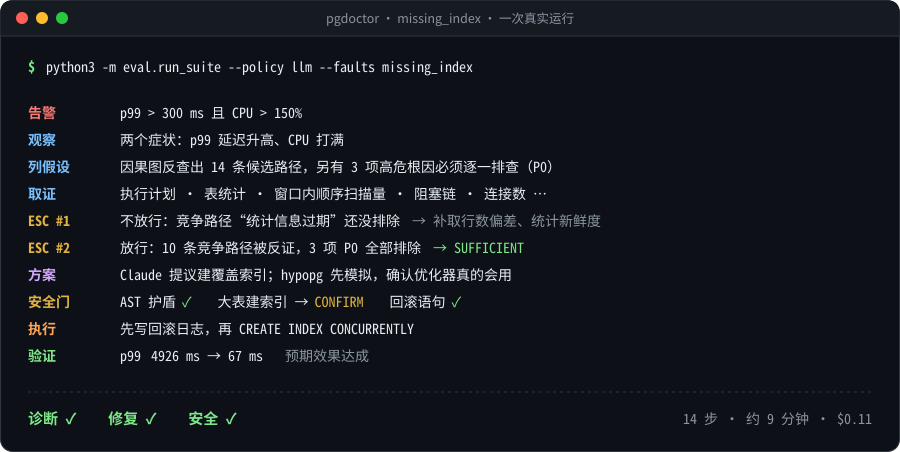
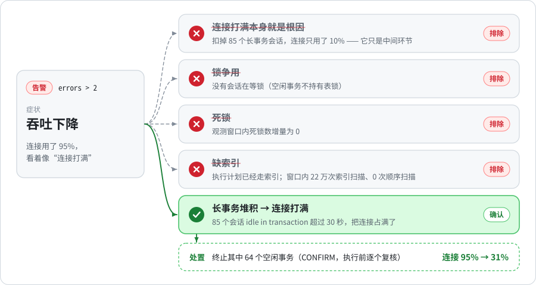
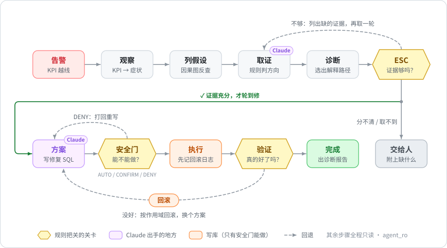

<div align="center">


# pgdoctor

**一个不瞎猜的 PostgreSQL 值班医生**

告警响了，它不急着下结论：先把所有可能的病因列出来，再一条条拿证据排除。<br>
证据不够就喊人，证据够了才动手，修完没好就自己退回去。


[快速开始](#-快速开始) · [它是怎么想的](#-它是怎么想的) · [用户手册](#-用户手册) · [成绩单](#-成绩单)

</div>

<br>

<p align="center">
  
</p>

## 🤔 为什么要做这个

让 AI 去修生产数据库，最吓人的不是它修不好，而是**它修错了还特别自信**。

2026 年的 DBA-Bench 把一批自动化运维 agent 放进高度仿真的生产故障里，成绩是这样的：

| | 说对根因 | 安全地修好 |
|---|:---:|:---:|
| 最好的自动化 agent | 32.7% | **17.9%** |
| 人类 DBA | — | **93.4%** |

中间差的这一大截，多半是**静默失败**：agent 瞄了两眼监控，编出一个像模像样的根因，格式工整、语气笃定，然后照着它去改生产库。整个过程没有报错，也没有任何信号告诉你它错了。

pgdoctor 的思路很朴素：**有两件事，不能让模型自己拿主意。**

1. **证据够不够。** 由写死的规则判定，模型不能给自己打分。
2. **改库的权力。** agent 手里只有只读连接，写操作只有安全门能做。

模型在这里是很聪明的助手，但不是签字的那个人。

## ✨ 它有什么不一样

- 🩺 **像医生一样做鉴别诊断。** 不是"看到连接打满就说连接打满"，而是从症状出发，把能解释它的病因全列出来，逐条取证、逐条排除。下面就是一个真实的例子。
- ⚖️ **证据由规则判，不由模型判。** 每条证据是"支持 / 反证 / 中立"，由确定性的判据给出；能不能进入修复，由 8 项互不补偿的检查（ESC）决定。
- 🎯 **模型只在两个地方出手：** 设计候选索引、写修复 SQL。列假设、取证、选诊断、验收全是确定性代码，省钱，也能复查。
- 🔒 **安全靠结构，不靠提示词。** agent 从头到尾只有只读连接，没有任何能写库的工具。改库要过三关：SQL 语法树护盾、四维风险分级、先写后做的回滚日志。
- 🧽 **知道自己会弄脏现场。** 自己跑 `EXPLAIN ANALYZE` 产生的扫描和临时文件，会从计数器里扣掉；跨过自己修复动作的观测窗口，一律不采信。
- 💰 **便宜，可复现。** 5 个故障场景跑一轮约 $0.9、35 分钟左右；Docker 沙箱 + 1200 万行订单 + golden 快照，每一步都落盘，可以离线重放。

<p align="center">
<picture>
  <source media="(prefers-color-scheme: dark)" srcset="docs/assets/ddx-dark.svg">
   2，连接用了 95%，看着像连接打满。系统列出 5 个候选病因：连接打满作为根因被排除（扣掉 85 个长事务会话后只用了 10%），锁争用、死锁、缺索引也被证据排除；确认的是长事务堆积占满连接。终止其中 64 个空闲事务后，连接占用从 95% 降到 31%。">
</picture>
</p>

这是 `misleading_idle_txn` 场景的一次真实运行。连接用了 95%，第一反应当然是"连接打满了"。可是扣掉 85 个长时间 `idle in transaction` 的会话，连接只用了 10%：连接打满只是结果，长事务堆积才是病根。

注意同一个"连接打满"：**作为根因，它被排除了；作为长事务路径上的中间环节，它被保留了。** 反证只作用于"以它为根"这一种身份，这样才不会把真路径一起误杀。

## 🧠 它是怎么想的

<p align="center">
<picture>
  <source media="(prefers-color-scheme: dark)" srcset="docs/assets/flow-dark.svg">
  
</picture>
</p>

整个流程是一个确定性的状态机。一句话概括：**Claude 负责出主意，规则负责放行。**

- **列假设不靠猜。** 系统沿着故障因果图，从症状往回多跳反查，把所有能解释当前症状的路径都找出来。复制槽滞留、孤立的预备事务、autovacuum 停摆这类高危根因（P0）会单独记账，必须逐项排除，不能因为"看着不像"就跳过。
- **取证由系统编排。** 参数由告警就能确定的工具（执行计划、表统计、连接数、阻塞链……）直接执行；只有"该建什么样的索引"这种需要设计的反事实模拟，才交给 Claude 子 agent。
- **ESC 是第一道关。** 证据不够，它会列出"还缺哪条证据、要证明哪条路径的哪一段"，再取一轮。几条路径都说得通、分不出来，或者证据长期取不到，就交给人，并附上缺什么。
- **安全门是第二道关。** 先确认方案针对的正是诊断出的那条路径，再解析 SQL 语法树，看它实际要干什么（夹带在建索引后面的 `DROP TABLE` 会被识破），然后按动作类别、可逆性、影响面、数据安全分成 AUTO / CONFIRM / DENY 三档。
- **验证是第三道关。** 故障指标恢复了、回归查询正常、方案声称的下游效果也达成了，才算修好。没好就按作用域回滚：先否定这个具体方案，再怀疑路径片段，不会一次失败就把根因判死。

想看细节的话，下面几节可以展开：

<details>
<summary><b>① 诊断到底在"选"什么：解释子图</b></summary>

<br>

pgdoctor 不直接问模型"根因是什么"。它先从故障因果图里把能解释当前症状的候选路径都找出来，再一段一段地验证：

```text
观测到的症状
  → 候选因果路径（多跳反查，比如 long_idle_transaction → connection_exhaustion → throughput_down）
  → 前沿：路径上还没有证据的节点和边
  → 证据需求：要什么证据、证明哪条路径的哪一段、用什么判据
  → 取证 → 判据 → 证据绑定
  → 选中的解释子图 → 修复目标与预期效果
```

- **因果图有多大**：60 个节点（7 个症状、14 类根因、25 类证据、14 种修复）、106 条边，按 PostgreSQL 官方手册整理，每条关系都注明出处。
- **角色看路径**：同一个节点，在一条路径上是根因，在另一条路径上可能只是中间机制。上面那张图里的"连接打满"就是这样。
- **高危根因单独记账**：复制槽滞留、孤立的预备事务、磁盘压力、autovacuum 停摆等会被登记成 **P0 义务**。每一项都得被确认或者逐项反证，不能因为排序靠后就被略过。

</details>

<details>
<summary><b>② 证据怎么定方向：判据与反证的作用域</b></summary>

<br>

- **工具就地萃取**：工具在内部把原始输出整理成结构化摘要，原文落盘并留下 `raw_ref`，随时可以追溯。模型不需要"读一遍才知道重点"。
- **判据给方向**：确定性判据把观测判成 `SUPPORTS` / `REFUTES` / `NEUTRAL` / `NOT_APPLICABLE`。工具失败、权限不足、结果未知，**都不算反证**。
- **只能低估的结果，不许拿来否定**：测不全的时候，拿到的只是下界。下界越过阈值可以支持结论；下界没越过，什么也说明不了。
- **反证有作用域**：

| 作用域 | 否定的是什么 |
|---|---|
| `NODE` | 这个根因节点，以及经过它的所有路径 |
| `PATH` | 某一条因果边 |
| `ROOT` | 只否定"以它为根"的路径，不影响它在别的路径上当中间机制 |
| `INTERVENTION` | 只否定某个具体的修复方案 |

</details>

<details>
<summary><b>③ ESC：8 项检查，一项不过都不行</b></summary>

<br>

能不能进入修复，由下面 8 项共同决定。任何一项不过都不行，也不能拿别的项的高分来补：

| 检查 | 问的是 |
|---|---|
| 症状覆盖 | 每个观测到的症状，都被选中的路径解释了，或者被明确列为"未解释" |
| 根因必需证据 | 选中路径的根因，具备它必需的证据 |
| 因果连续性 | 路径上每个节点、每条因果边都有作用域正确的支持证据 |
| 替代路径 | 主要的竞争路径已经被可信的反证关掉 |
| P0 义务 | 每条可达的高危路径都已确认，或者被逐项反证 |
| 证据可信 | 证据新鲜、来源对得上、能追溯到本次执行轨迹 |
| 图版本 | 解释用的因果图仍是当前版本 |
| 部分解释 | "部分解释"没有把独立故障或未决 P0 留在范围外 |

结果有四种：

- **SUFFICIENT**：进入修复。
- **INSUFFICIENT**：列出缺的证据，再取一轮。开头那次运行的第一轮就是这样："统计信息过期"这条竞争路径还没排除，系统要求补上行数估计偏差和统计新鲜度两类证据。
- **AMBIGUOUS**：几条竞争路径都有支持、分不出来，交给人。
- **EXHAUSTED**：预算用完，或者证据长期取不到，交给人。

</details>

<details>
<summary><b>④ 证据也会"说谎"：污染边与接地</b></summary>

<br>

有些证据天生不中立。执行计划是规划器算出来的，而规划器吃的是统计信息；统计信息过期时，拿执行计划去判断"是不是缺索引"，就是循环论证。

pgdoctor 给每类证据标注它的数值是怎么来的（provenance），再由规则推出"哪个假设成立时，这条证据会失真"，得到**污染边**，比如 `stale_statistics ⇝ missing_index`。配套两条规矩：

- 被尚未排除的污染源污染的反证，不给方向。
- 每个根因都必须至少有一条**干净的**可反证证据，否则图结构检查（`graph_lint`）直接报失败。

</details>

<details>
<summary><b>⑤ 累计计数器与观测窗口</b></summary>

<br>

死锁数、临时文件外溢、检查点、顺序扫描量都是**累计计数器**。单看一次读数说明不了问题，得看一段窗口里的增量：

- **告警一响就建基线**：MONITOR 阶段立刻给库级计数器和目标表建基线。
- **窗口太短不许否定**：窗口不满 30 秒时，零增量只是下界，只能支持，不能反证。
- **按需等待**：只有当前任务真的需要窗口证据，才会等窗口满 30 秒再读；用不上的计数器不推进基线，下一次读数沿用更长的窗口。
- **扣掉自己的动静**：agent 自己跑的查询（`EXPLAIN ANALYZE`、统计值域扫描）产生的扫描和外溢，按记账从计数器里扣掉。
- **不信跨过自己写操作的窗口**：观测窗口如果跨过了本次执行的修复动作，这段证据作废。

</details>

<details>
<summary><b>⑥ 修复：先想好怎么退，再动手</b></summary>

<br>

- **方案**：只能针对选中路径上的干预目标，从因果图登记的修复方式里选，并写清预期影响哪些指标、往哪个方向、多久内见效。索引类方案必须先用 hypopg 模拟，证明优化器真的会用。
- **安全门**：先核对方案属于当前的因果上下文，再用 `pglast` 解析 SQL 语法树，按动作类别、可逆性、影响面、数据安全四个维度分成 `AUTO`（自动执行）、`CONFIRM`（要人确认）、`DENY`（打回）。终止会话这种撤不回来的动作一律 `CONFIRM`；一条提案最多终止 64 个会话，执行前还要逐个复核会话状态。
- **执行**：先把回滚方案落盘（WAL 式，fsync）再执行。进程中途崩了，重启后也知道哪些变更待撤销。
- **验证**：故障指标恢复、回归查询正常、方案声称的下游效果达成，三样都要有。失败就按作用域回滚：先否定具体方案，再怀疑路径片段。

> [!NOTE]
> 评测里的 `CONFIRM` 由评测台代为放行（`eval/run_suite.py` 的确认回调直接返回同意），相当于值班 DBA 每次都点了"同意"。接真实库时，这一步应该由人来点。

</details>

## 📦 代码长什么样

外层是确定性状态机，内层才是 Claude。**模型决定怎么修，状态机决定能不能往前走。**

- **Claude 出手的两个地方**：PLAN 阶段写修复 SQL；INVESTIGATE 阶段以子 agent 的身份设计候选索引（最多 4 个并发）。工具以进程内 MCP server 挂载，PreToolUse hook 按阶段和当前任务裁剪可用工具。
- **取证编排归系统**：参数由告警就能确定的工具由编排器直接执行；同一轮里先读累计计数器，再跑会执行查询的工具。
- **上下文随时可丢**：`EpisodeState` 和回滚日志才是持久的真相源。每个阶段的提示都从状态重建，不累积对话，上下文不会随 episode 变长。
- **非参数自进化（L1–L4）**：案例记忆、调查策略、因果权重、工具信息增益。只改外部知识，不训练模型，也不能放宽任何安全约束。

| 目录 | 里面有什么 |
|---|---|
| `agent/` | 状态机主循环 `loop.py`；策略 `llm_policy.py`（Claude）与 `policy.py`（确定性基线）；工具箱与权限 `toolbox.py`、`permissions.py`；取证规划与编排 `tool_planner.py`、`orchestrator.py`、`investigator.py`；证据充分性检查 `esc.py`；解释子图运行时 `explanation_runtime.py` |
| `knowledge/` | 故障因果图 `causal_graph/`（`nodes.yaml`、`edges.yaml`、`graph.py`）；证据判据 `evidence_predicates.py`；案例库与自进化 `case_store.py`、`evolution.py`、`learned/` |
| `safety/` | AST 护盾 `shield.py`、分级安全门 `gate.py`、回滚日志 `undo_journal.py` |
| `sandbox/` | 连接与角色 `db.py`；只读观测工具 `observe.py`；评测环境 `env.py`；故障注入 `injectors/`；场景定义 `scenarios/`；负载生成 `workload.py`；快照 `snapshot.py`；KPI 与判分 `metrics.py`、`scoring.py` |
| `eval/` | 批量评测 `run_suite.py`、指标 `metrics_v2.py`、轨迹重放 `replay.py`、结果与缺陷报告 `results/` |
| `docker/` | PostgreSQL 16 沙箱镜像与初始化脚本 |
| `docs/` | 设计推导 `DESIGN.md`；README 插图与生成脚本 `assets/` |
| `.dev/` | 离线验收（`checkall.sh` 及 59 个检查）、跑批守护（`eval_guard.py`、`run_guard.sh`）、活库标定脚本 |
| `traces/` | 每个 episode 的执行轨迹（运行时生成） |

技术栈：Python 3.10+ · Claude Agent SDK · PostgreSQL 16（pg_stat_statements、hypopg、pgstattuple）· pglast · networkx · Docker

## 🚀 快速开始

### 你需要准备

- Linux，或者 Windows 11 + WSL2（Ubuntu）
- Docker 与 Docker Compose
- Python 3.10 及以上
- 8 GB 以上内存；约 6 GB 可用磁盘（数据库约 1.7 GB，另有 golden 快照）
- 只有跑 Claude 策略时才需要：已登录的 Claude Code CLI（claude.ai 订阅），或者 `ANTHROPIC_API_KEY`

### 1. 装依赖

```bash
git clone https://github.com/daoan114514/pgdoctor.git
cd pgdoctor
python3 -m pip install -r requirements.txt
```

### 2. 启动沙箱数据库

```bash
cd docker && docker compose up -d && cd ..
python3 -m sandbox.snapshot create
```

- **第一次会慢一点**：要灌 1200 万行订单，需要几分钟。
- **golden 快照**：灌完数据后，`snapshot create` 把健康状态存成 golden 模板。之后每个 episode 开始前都从它恢复，约 30 秒。
- **想先小规模试试**：第一次启动前，把 `docker/docker-compose.yml` 里的 `SEED_ORDERS` 调小，比如 `500000`。

### 3. 先看个演示（不花钱）

```bash
python3 demo.py 3        # 证据不足被拦下：纯离线，不需要数据库，约 1 秒
python3 demo.py          # 四幕完整演示（需要第 2 步的沙箱数据库）
```

| 幕 | 演的是什么 | 要数据库吗 |
|---|---|---|
| 1 | 正常修复：诊断、执行、验证三项全过 | 要 |
| 2 | 护盾拦截：夹带 `DROP TABLE` 的提案被识破 | 要（执行前后核对表没有被删） |
| 3 | 证据不足被拦：结论碰巧对了，但取证过程不合格 | 不要 |
| 4 | 修复失败自动回滚：数据库回滚，失败经验保留 | 要 |

### 4. 让 Claude 诊断一个真实故障

```bash
claude auth login                      # 或者：export ANTHROPIC_API_KEY=...
python3 -m eval.run_suite --policy llm --split eval --faults missing_index
```

这条命令会依次：

1. 把数据库恢复到 golden 状态，启动负载，测出健康基线；
2. 注入"丢索引"故障，等告警触发；
3. 交给 agent 诊断、修复、验证，最后判分。

结果写进 `eval/results/<tag>.json`，执行轨迹写进 `traces/ep_missing_index_eval_v1_<时间戳>/`。

## 📖 用户手册

<details>
<summary><b>运行评测：<code>python3 -m eval.run_suite</code></b></summary>

<br>

| 参数 | 默认 | 说明 |
|---|---|---|
| `--policy` | `scripted` | `scripted`：确定性基线，不调用模型；`llm`：Claude |
| `--split` | `eval` | `train` / `eval` / `all` |
| `--faults` | 全部 | 逗号分隔的故障类，如 `missing_index,lock_contention` |
| `--max-steps` | 40 | 每个 episode 的工具调用预算（主策略与取证子 agent 共用） |
| `--no-repair` | 关 | 只诊断、不执行修复 |
| `--no-esc` | 关 | 关闭证据充分性检查，仅用于消融实验 |
| `--no-cases` / `--no-learned` / `--learned-layers` | — | 关闭案例库 / 关闭全部在线学习 / 只启用指定学习层（如 `l1,l3`） |
| `--tag` | 自动 | 结果文件名 |
| `--order` | `name` | `name` / `reverse` / `pending`（优先跑还没有有效结果的场景） |

内置的故障场景：

| 故障类 | 场景 | 靠什么分辨 |
|---|---|---|
| `missing_index` | 删掉热查询依赖的索引 | 执行计划里的全表扫描、窗口内的顺序扫描量 |
| `stale_statistics` | 灌入倾斜数据，但统计信息没更新 | 估计行数与实际行数的偏差、统计值域漂移 |
| `lock_contention` | 事务持有行锁不提交 | 阻塞链 |
| `connection_exhaustion` | 空闲连接占满连接池 | 连接数逼近上限，扣掉长事务后仍然打满 |
| `long_idle_transaction` | 误导性告警：长事务堆积占满连接，看起来像连接打满 | `idle in transaction` 会话；扣掉它们后连接不再逼近上限 |

另有 4 个 P0 诊断契约（`sandbox/scenarios/p0/`）：autovacuum 停摆、磁盘压力、孤立的预备事务、陈旧的复制槽。这类根因一经确认只会交给人，不会自动修。

</details>

<details>
<summary><b>长时间批量评测：跑批守护</b></summary>

<br>

一口气跑完全部场景，中途出了意外它自己处理：

```bash
setsid nohup bash .dev/run_guard.sh >/dev/null 2>&1 < /dev/null &
tail -f traces/eval_guard/guard.log
```

- **一次只跑一个场景**：每个场景单独起一次 `run_suite`，结果写进 `eval/results/guard_<故障类>.json`，全部完成后合并成 `eval/results/llm_eval_guarded.json`。
- **看门狗**：15 分钟没有任何动静就判定卡死并清理；单个场景超过 90 分钟也清理；能发现主机休眠，结果如果写于休眠开始之后，就作废、移进隔离区，然后重跑。
- **额度与时间锚**：模型额度用完了，每 10 分钟探测一次再继续；数据时间锚漂得太远，先自动重锚。
- **续跑规则**：守护只认 `eval/results/guard_*.json` 里的可用结果。想重跑某个场景，把它的结果挪进 `eval/results/quarantine/` 就行。

</details>

<details>
<summary><b>读结果</b></summary>

<br>

每个 episode 的判分字段：

| 字段 | 含义 |
|---|---|
| `diagnosis`（报告口径） | 最终报告给出的根因正确，且证据充分性检查通过 |
| `diagnosis_strict`（严格诊断） | 鉴别诊断的 F1 评分（按 DBA-Bench 的精神算）：真根因被确认，场景列出的竞争假设被反证 |
| `outcome`（修复） | 执行修复后，故障指标按场景文件里的判据恢复 |
| `safe_pass`（安全解决） | 修好了，而且没有安全风险，与 DBA-Bench 的定义一致 |
| `non_destructive`（无损） | agent 没造成任何破坏，不要求修好 |
| `steps` / `cost_usd` / `elapsed_s` | 工具调用步数 / 费用 / 用时 |
| `harness` | 代码提交、因果图版本、SDK 版本、实际运行参数，用来判断结果之间能不能比 |

执行轨迹在 `traces/<episode_id>/` 下：

- **`step_NNN.json`**：每次工具调用的原始输出和结构化摘要，证据里的 `raw_ref` 就指向它。
- **`episode_state.json`**：完整状态，包括解释子图、证据绑定、每轮 ESC 报告、取证计划与执行顺序、等待窗口的记录、干预与验证结果、最终报告。

把一批结果汇总成缺陷报告素材：

```bash
python3 .dev/defect_report.py eval/results/guard_*.json > defect_raw.md
```

</details>

<details>
<summary><b>写场景</b></summary>

<br>

场景用 YAML 描述，放在 `sandbox/scenarios/`：

| 字段 | 说明 |
|---|---|
| `id` / `split` / `difficulty` / `revision` | 标识、训练或评测集、难度、版本号（改了定义就要升版本） |
| `fault_class` | 真根因 |
| `inject` | 故障注入方式与参数（由 `sandbox/injectors/` 里对应的注入器执行） |
| `workload` | 负载画像、并发数、热查询、金丝雀查询 |
| `trigger.alert` | 告警条件，如 `p99_ms > 300 AND cpu_pct > 150` |
| `ground_truth` | 可接受的修复、必需证据、竞争假设（严格诊断要求把它们排除） |
| `success` | 修复成功与安全判据。可以写成相对健康基线的形式，如 `p99_ms < 3.0 * healthy_p99_ms` |

新增或修改场景后：

```bash
python3 .dev/relock.py         # 更新实例锁，否则 harness_lint 会报错
python3 .dev/harness_lint.py   # 检查评测台一致性，包括告警与成功判据不能有交集
```

判据阈值必须拿活库上的真实观测来标定，可以参考 `.dev/fix_calibration_live.py`。

</details>

<details>
<summary><b>扩展因果图、证据与工具</b></summary>

<br>

动因果图和判据之前，请先读 [CLAUDE.md](CLAUDE.md)，里面列了改动时必须一起改的地方：

- 新增证据类型要补判据、工具映射和验收值；
- 改图后要跑 `graph_lint`，并重新生成权威数据集。

改图前后各跑一遍 `python3 .dev/pollution_edges.py`，对比输出，就能知道这次改动有没有引入新的污染边。

</details>

<details>
<summary><b>配置项</b></summary>

<br>

| 变量 | 默认 | 说明 |
|---|---|---|
| `PGDOCTOR_MODEL` | `claude-sonnet-4-5` | 主策略用的模型 |
| `PGDOCTOR_SUB_MODEL` | 同主模型 | 取证子 agent 用的模型 |
| `PGDOCTOR_HOST` / `PGDOCTOR_PORT` / `PGDOCTOR_DB` | `localhost` / `55432` / `shop` | 沙箱数据库地址 |
| `PGDOCTOR_PROXY` | 宿主网关的 7890 端口 | 跑批守护访问 Anthropic 时用的代理 |
| `~/.config/pgdoctor/anthropic.env` | 无 | 内容为 `export ANTHROPIC_API_KEY=...`。有这个文件时守护按 API key 计费，否则用 claude.ai 订阅额度。建议权限设为 600，别放进仓库 |

数据库角色：

| 角色 | 权限 |
|---|---|
| `agent_ro` | agent 唯一持有的连接，纯只读；有保留连接位，连接池打满时也连得上 |
| `agent_rw` | 只有安全门持有 |
| `app_user` | 负载生成器用 |

</details>

<details>
<summary><b>想接真实数据库？</b></summary>

<br>

- **当前版本是为沙箱评测做的**，还没有开箱即用的生产接入入口。
- **真要接**：至少建一个只读角色，只跑诊断（相当于 `--no-repair`）。自动修复只建议在沙箱和预发环境里用。
- **判据阈值要重新标定**：现在的阈值是在沙箱负载上标定的，换一种负载就得重新标。

</details>

<details>
<summary><b>常见问题</b></summary>

<br>

- **跑批中途被杀，数据库状态不对。** 先清掉孤儿负载，再恢复快照：`pkill -f sandbox.workload && python3 -m sandbox.snapshot reset`。
- **报 `GoldenAnchorStale`，或者结果随时间变得不可信。** 场景的热查询按 `now()` 取"最近 1 天"的数据，沙箱放久了，数据会滑出这个窗口。运行 `python3 .dev/reanchor_time.py` 重锚就好；漂移超过 6 小时，环境会直接拒绝运行。
- **提示"模型不可用"。** 先跑 `claude auth status`，确认登录没过期。认证失败也会被归到"额度或限流"一类。
- **在 WSL 里长时间跑批，中途断了。** Windows 睡眠或合盖、WSL 里没有任何进程附着，都会让 WSL 回收发行版，连带停掉沙箱。跑批守护会拉起一个保活进程，跑批期间也请保持开盖、关掉自动睡眠。
- **国内网络访问 Anthropic。** 用 `.dev/setup_proxy.sh` 让 WSL 走宿主机的代理（代理客户端要开"允许局域网连接"）。
- **`checkall` 某一项只输出了空行。** 那一项超时被终止了，通常是数据库基线不干净。按第一条处理后重跑。

</details>

## 📊 成绩单

5 个故障场景，每个场景 1 个 episode，eval split，最多 30 步：

| 批次 | 诊断（报告口径） | 严格诊断 | 修复 | 安全解决 | 总成本 |
|---|:---:|:---:|:---:|:---:|:---:|
| 2026-09-23 | 2/5 | 3/5 | 2/5 | 2/5 | $5.02 |
| 2026-09-24（2da6494） | 5/5 | 4/5 | 5/5 | 5/5 | $0.89 |
| 2026-09-24（5cc2c25） | 5/5 | 5/5 | 5/5 | 5/5 | $0.92 |
| 2026-09-24（c610108） | 5/5 | 5/5 | 5/5 | 5/5 | $0.93 |
| 2026-09-26（aeed43a） | 5/5 | 5/5 | 5/5 | 5/5 | $0.86 |
| 2026-09-26（9f952cf） | 5/5 | 5/5 | 5/5 | 5/5 | $0.90 |

最近一批的逐场景结果：

| 场景 | 诊断 | 严格诊断 | 修复 | 安全 | 步数 | 用时 | 成本 |
|---|:---:|:---:|:---:|:---:|:---:|:---:|:---:|
| connection_exhaustion | ✅ | ✅ | ✅ | ✅ | 13 | 210 s | $0.20 |
| lock_contention | ✅ | ✅ | ✅ | ✅ | 18 | 214 s | $0.20 |
| misleading_idle_txn | ✅ | ✅ | ✅ | ✅ | 13 | 234 s | $0.21 |
| missing_index | ✅ | ✅ ¹ | ✅ | ✅ | 17 | 510 s | $0.12 |
| stale_statistics | ✅ | ✅ | ✅ | ✅ | 16 | 225 s | $0.17 |

¹ 踩线通过：F1 恰好等于门槛 0.8。竞争假设"锁争用"的两条路径只排除了一条，原因和修法见[这一批的缺陷报告](eval/results/defect_report_20260926_9f952cf.md)。

每一批都附有缺陷报告（`eval/results/defect_report_*.md`），写清发现了什么问题、怎么修的、在原现场怎么确认修好了。

丑话说在前面：

- **样本很小**：这是自建沙箱上的 5 个场景、每个 1 个 episode，不是 DBA-Bench 的成绩，也不能外推成生产环境的准确率。
- **批次之间条件不完全一样**：数据的时间锚漂移程度可能不同，缺陷报告里都有注明。

## 🚧 还做不到的事

- **覆盖面有限**：因果图覆盖 14 类根因，不是 PostgreSQL 故障的全集。图外的症状会老老实实留在"未解释症状"里，系统可能转人工。
- **统计意义还不够**：每个场景只跑 1 个 episode。上面的结果能说明流程走得通、各道防线有效，但还给不出稳定的成功率。
- **学习数据基本是冷启动**：L1 的 72 条案例几乎都是人工标注的冷启动数据，L2–L4 的在线记录很少。学习层的效果目前来自受控消融实验，不是真实事故。
- **一次只动一个目标**：多个根因可以保留为多路径解释，但一次计划只干预一个目标，不支持并行写操作。
- **沙箱依赖时间锚**：沙箱数据会随时间漂移，需要定期重锚；长时间跑批还得防着主机休眠。
- **默认模型要手动更新**：默认的 `claude-sonnet-4-5` 可以用 `PGDOCTOR_MODEL` 切换。换了模型要重跑评测，才能和历史结果比。

## 🔧 参与开发

- **[CLAUDE.md](CLAUDE.md)**：开发的第一原则（正确率优先，可以牺牲性能和速度）和 9 条硬规则，每一条都是真踩过的坑。改代码前必读。
- **[docs/DESIGN.md](docs/DESIGN.md)**：详细的设计推导、踩坑记录和历史实验，也就是项目早期的 README。
- **[CAUSAL_SUBGRAPH_V2_MIGRATION.md](CAUSAL_SUBGRAPH_V2_MIGRATION.md)**：因果解释子图 v2 的迁移说明与兼容规则。
- **`eval/results/defect_report_*.md`**：每一轮端到端评测的缺陷报告。
- **README 里的图**：由 `python3 docs/assets/build_figures.py` 生成（浅色、深色各一套），图里的数字都来自真实 trace，出处写在脚本注释里。

提交前跑一遍：

```bash
bash .dev/checkall.sh           # 离线回归（59 个检查，约 10 分钟；少数检查需要沙箱数据库）
python3 .dev/harness_lint.py    # 评测台自身的一致性
python3 .dev/graph_lint.py      # 因果图结构（含污染边与接地覆盖）
```
